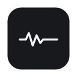
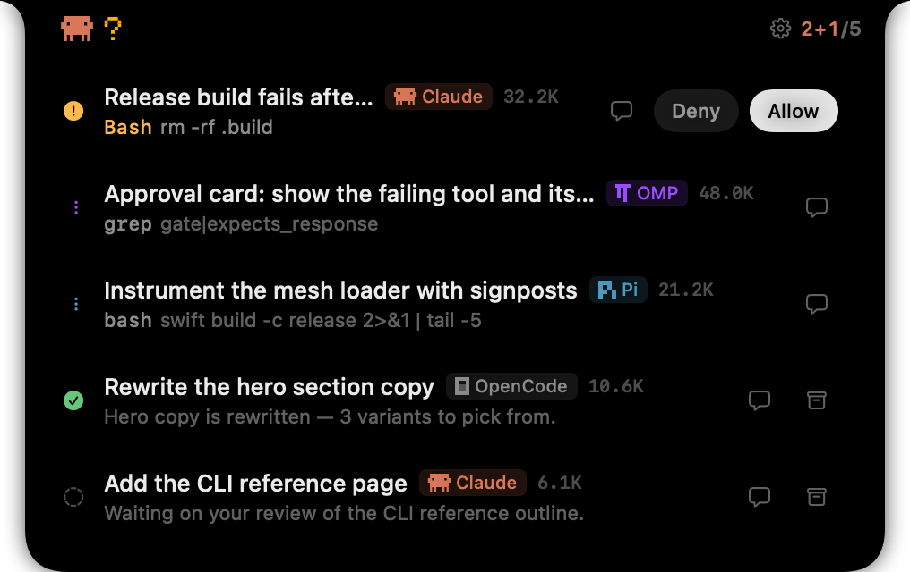
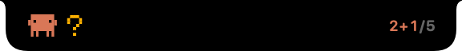
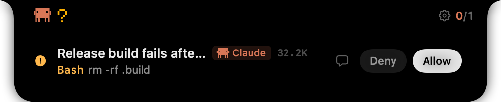
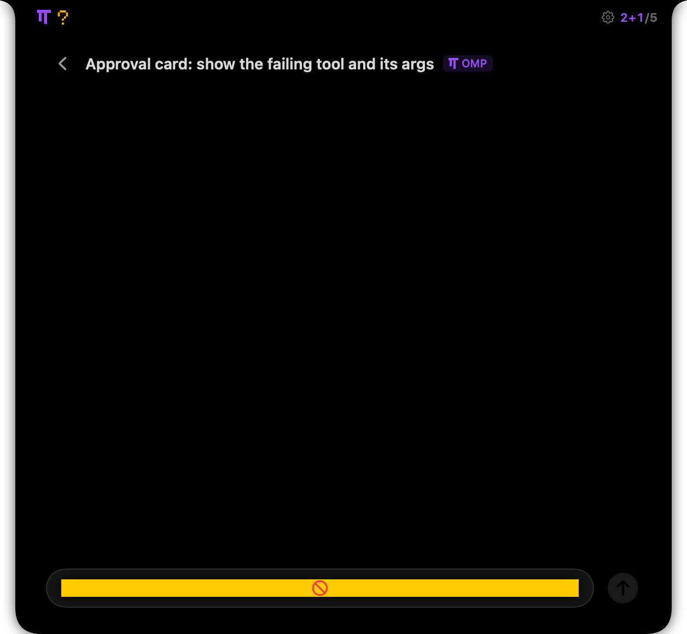
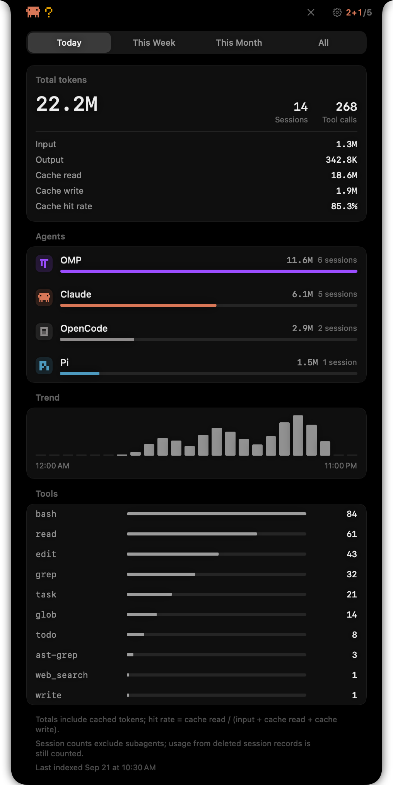
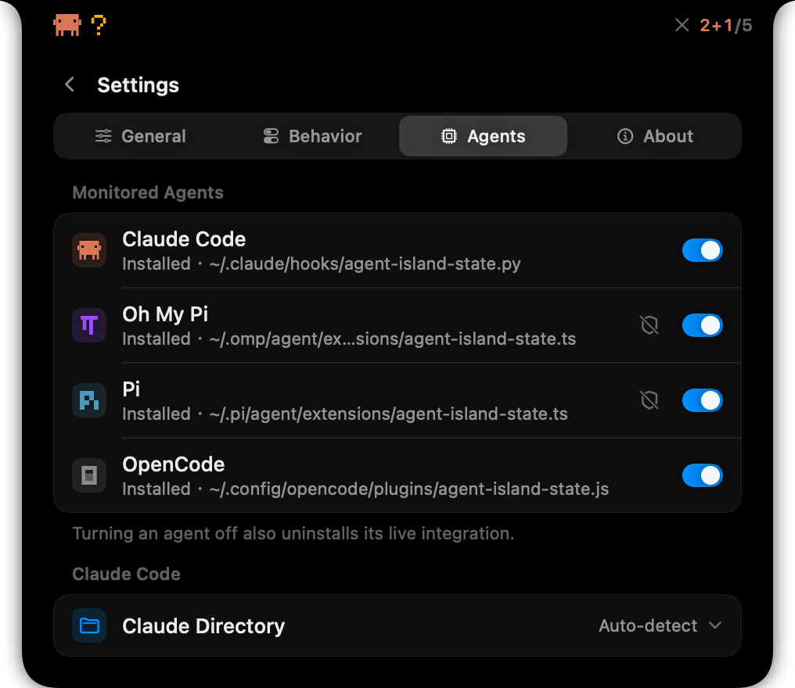
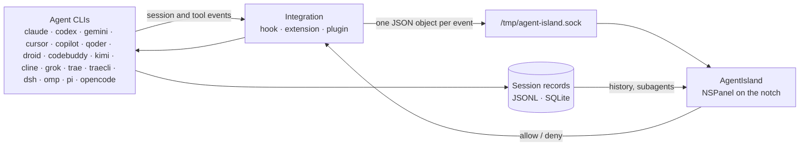

<div align="center">
  
  <h1 align="center">AgentIsland</h1>
  <p align="center">
    <b>Your coding agents, on the MacBook notch.</b><br>
    Live session state, chat history, usage stats and tool approvals for 17 coding agents — Claude Code, Codex, Gemini CLI, Cursor, Copilot, Qoder, Factory, CodeBuddy, Kimi Code CLI, Cline, Grok CLI, Trae, Trae CLI, DeepSeek Harness, Oh My Pi, Pi and OpenCode — one glance, no window switching.
    <br><br>
    <a href="https://github.com/seehar/agent-island/releases/latest"></a>
    <a href="https://github.com/seehar/agent-island/releases"></a>
    
    
    <a href="LICENSE.md"></a>
  </p>
</div>

**English** | [简体中文](README.zh-CN.md)



## Why

Two agents in tmux already means tab-hunting to find the one that is waiting on you. Five means a permission prompt sits unanswered while you read code.

The notch is the one strip of the screen you never leave. AgentIsland makes it the status light for your agents:

- **Closed** — a capsule that stays out of the way. Its left mark animates while an agent works, the right side reads `active[+subagents]/total`. The capsule widens just enough to keep that count clear of the camera housing, and only at extreme counts drops the least important number instead of truncating it.
- **Hover** — it expands into one live list across every agent you run.
- **Approval** — a tool call that needs permission opens the panel with Allow / Deny, and your answer travels back to the agent.

- **Stats** — a usage page inside **Settings → Statistics**: tokens, sessions and tool calls, per agent, for today, this week, this month or all time. The header's chart button jumps straight to it.

<table>
  <tr>
    <td width="50%"></td>
    <td width="50%"></td>
  </tr>
  <tr>
    <td align="center"><sub>Closed: brand mark + working sessions</sub></td>
    <td align="center"><sub>A pending tool call, decided in place</sub></td>
  </tr>
</table>

## Features

**One list for every agent.** 17 CLIs side by side — Claude Code, Codex, Gemini CLI, Cursor, Copilot, Qoder, Factory, CodeBuddy, Kimi Code CLI, Cline, Grok CLI, Trae, Trae CLI, DeepSeek Harness, Oh My Pi (`omp`), Pi and OpenCode — each with its own brand mark and badge. Turn off the agents you don't run and they disappear from the list entirely.

**Subagents included.** Claude Code tool calls inside subagents, and `omp`/`pi` subagent runs, count towards the notch badge and are listed under the `task` card that spawned them.

**Approvals on the notch.** Allow / Deny for every agent that can hand the decision back: Claude Code and its forks (Qoder), Codex, Gemini CLI and Trae CLI through their permission hooks, `omp`/`pi` through a blocking extension gate (opt-in), OpenCode through its plugin. The rest still show up and are approved in their own terminal. Calls classified as dangerous — `rm -rf /`, `sudo rm`, `mkfs`, `dd … of=/dev/…`, `curl … | sh`, reverse shells, `kill -9 1` — are flagged in red, and their fail-open path is never used.

**Usage stats.** Coverage follows what each tool actually records. Token numbers come from the agents whose records carry a token field we could verify — Claude Code (and its forks Qoder / Factory), Oh My Pi, Pi, Codex and OpenCode. Tool-call counts follow each agent's record format: Claude Code, its forks, Oh My Pi, Pi, Codex, Cursor and Copilot. Gemini, Kimi, Cline, Grok, Trae, Trae CLI and DeepSeek Harness provide no checkable usage fields (or no readable records at all), so they do not appear on the stats page. The header's chart button opens a stats page: total tokens with input / output / cache read / cache write and hit rate, session and tool-call counts, for **Today / This Week / This Month / All** — split per agent, with a trend chart and a tool leaderboard. The numbers are indexed from the agents' own session records, so finished sessions still count.

**Chat history, rendered.** The full conversation with Markdown, tool call cards with their results, subagent runs inline, and the question when a tool is waiting for your input.



**Works with or without the integration.** Sessions are discovered by reading each agent's own records — JSONL transcripts (Claude Code, Qoder, Factory, CodeBuddy, Codex, Gemini, Cursor, Copilot, Kimi, Cline, Grok), or OpenCode's SQLite store — and status is inferred from the transcript. Trae, Trae CLI and DSH have no readable records and rely on their integration (DSH on the external [dsh-island](https://github.com/cdxiaodong/dsh-island) plugin). Installing the integration adds live events immediately, and on `omp`/`pi` it is what makes the approval gate possible.

**Small by design.** No Dock icon, no menu bar item, no daemon: a local Unix socket, one `NSPanel` on the notch, and your agents' own files.

**Yours to tune.** Hover delay, idle behaviour, panel size, row density, click action, refresh cadence, notification scope, content text size, notch height and width, and the language (English / 简体中文) — all switchable at runtime.

## Usage stats



The page lives in **Settings → Statistics** (the chart button in the panel header jumps straight to it) and reads the same records the chat view does, keeping only aggregate counters in its own store. Totals include cached tokens (hit rate = cache read / (input + cache read + cache write)); session counts exclude subagents. The index runs in the background on first open, and the page reports when it last indexed. The ↻ **Rescan** button beside the range switch re-reads every session record and recomputes the numbers — the background pass only reads the tail of each record, so this is the way to fix totals that look off.

## Supported agents

|Agent|Session records|Live integration|Approve from the notch|Subagents|
|---|---|---|---|---|
|**Claude Code**|`~/.claude/projects/**/*.jsonl`|`~/.claude/hooks/agent-island-state.py` + `settings.json`|yes — hook `PermissionRequest`|tool calls inside subagents|
|**Oh My Pi** (`omp`)|`~/.omp/agent/sessions/**`|`~/.omp/agent/extensions/agent-island-state.ts`|yes — extension gate (opt-in)|`task` runs|
|**Pi**|`~/.pi/agent/sessions/**`|`~/.pi/agent/extensions/agent-island-state.ts`|yes — extension gate (opt-in)|`task` runs|
|**OpenCode**|`~/.local/share/opencode/opencode.db`|`~/.config/opencode/plugins/agent-island-state.js`|yes — plugin|`task` runs|
|**Codex**|`$CODEX_HOME/sessions/YYYY/MM/DD/rollout-*.jsonl`|`$CODEX_HOME/hooks.json` (+ `[features] hooks = true` in `config.toml`)|yes — hook `PermissionRequest`|—|
|**Gemini CLI**|`~/.gemini/tmp/<project>/chats/session-*.jsonl`|`~/.gemini/settings.json`|yes — hook `BeforeTool`|—|
|**Cursor**|`~/.cursor/projects/**/agent-transcripts/**`|`~/.cursor/hooks.json`|—|—|
|**Copilot**|`~/.copilot/jb/<id>/partition-*.jsonl` (current) · `~/.copilot/session-state/<id>/events.jsonl` (legacy)|`~/.copilot/hooks/agent-island.json`|—|—|
|**Qoder**|`~/.qoder/projects/**/*.jsonl`|`~/.qoder/settings.json`|yes — hook `PermissionRequest`|Claude-style subagent events|
|**Factory** (`droid`)|`~/.factory/sessions/**/*.jsonl`|`~/.factory/settings.json`|—|Claude-style subagent events|
|**CodeBuddy**|`~/.codebuddy/projects/**/*.jsonl`|`~/.codebuddy/settings.json`|—|Claude-style subagent events|
|**Kimi Code CLI**|`~/.kimi-code/sessions/**`|`~/.kimi-code/config.toml`|—|—|
|**Cline**|VS Code global storage `saoudrizwan.claude-dev`|`~/Documents/Cline/Hooks/<EventName>` (one file per event)|—|—|
|**Grok CLI**|`$GROK_HOME/sessions/<enc-cwd>/<id>/chat_history.jsonl`|`$GROK_HOME/hooks/agent-island.json`|—|—|
|**Trae**|— (no readable records)|`~/.trae/hooks.json`|—|—|
|**Trae CLI**|— (no readable records)|`~/.trae/traecli.yaml` (managed block)|yes — hook `permission_request`|—|
|**DeepSeek Harness** (`dsh`)|— (records are zstd-compressed)|none — the external dsh plugin writes the socket directly|—|—|

> **Codex needs one manual step**: Codex does not run a hook it has not been shown. After installing, start Codex once and run `/hooks` to review and trust the AgentIsland entries — until then Codex silently ignores them (which looks exactly like "Codex is not supported"). If an update rewrites `hooks.json`, the review is needed once more.
>
> **What "no" means per agent**: Cursor, Copilot, Trae, Cline, Kimi, Factory and CodeBuddy have no blocking permission hook, so their approvals stay in their own terminal; Trae and Trae CLI write no readable session records (live events only), and DeepSeek Harness keeps its records zstd-compressed, so its history is not read (it needs the external dsh plugin to report events at all).

## Install

**Requirements:** macOS 15.6 or later, Apple Silicon.

Download the newest `AgentIsland-x.y.z.dmg` from the [releases page](https://github.com/seehar/agent-island/releases/latest), open it and drag **AgentIsland** into `Applications`.

> **About the first-launch warning.** Builds are ad-hoc signed and not notarized, so Gatekeeper blocks the first open. Right-click the app and choose **Open**, or clear the quarantine flag once:
>
> ```bash
> xattr -dr com.apple.quarantine /Applications/AgentIsland.app
> ```

Or build it yourself (Xcode required) with the same pipeline that produces the releases:

```bash
git clone https://github.com/seehar/agent-island.git
cd agent-island

./scripts/build-and-install.sh               # gate → archive → ad-hoc sign → install → launch
./scripts/build-and-install.sh --build-only  # stop after build/export/AgentIsland.app and releases/*.dmg
./scripts/build-and-install.sh --no-launch   # install, don't launch
```

The script runs `scripts/gate.sh` first — the localization guard plus a Release build that must finish with zero warnings — and aborts if anything is off.

## First run

AgentIsland writes exactly one file per agent (its integration) and deletes it when you turn that agent off. Nothing else on disk is touched.

|Agent|File written|Also touched|
|---|---|---|
|Claude Code|`~/.agent-island/hooks/agent-island-state.py`|hook entries merged into `~/.claude/settings.json`|
|Oh My Pi|`~/.omp/agent/extensions/agent-island-state.ts`|only if you enable the gate: `~/.omp/agent/config.yml`, backed up first|
|Pi|`~/.pi/agent/extensions/agent-island-state.ts`|—|
|OpenCode|`~/.config/opencode/plugins/agent-island-state.js`|—|
|Codex|`~/.agent-island/hooks/agent-island-state.py` (shared)|`$CODEX_HOME/hooks.json` entries + `[features] hooks = true` in `$CODEX_HOME/config.toml`|
|Gemini CLI / Cursor / Copilot / Qoder / Factory / CodeBuddy|`~/.agent-island/hooks/agent-island-state.py` (shared)|`~/.gemini/settings.json` / `~/.cursor/hooks.json` / `~/.copilot/hooks/agent-island.json` / `~/.qoder/settings.json` / `~/.factory/settings.json` / `~/.codebuddy/settings.json`|
|Kimi Code CLI|`~/.agent-island/hooks/agent-island-state.py` (shared)|`~/.kimi-code/config.toml` `[[hooks]]` blocks|
|Cline|`~/.agent-island/hooks/agent-island-state.py` (shared)|`~/Documents/Cline/Hooks/<EventName>` files|
|Grok CLI / Trae / Trae CLI|`~/.agent-island/hooks/agent-island-state.py` (shared)|`$GROK_HOME/hooks/agent-island.json` / `~/.trae/hooks.json` / `~/.trae/traecli.yaml`|
|DeepSeek Harness|—|— (the dsh plugin owns its own integration)|

Open **Settings → Agents** (the gear button in the panel, then the *Agents* page) to see each agent's integration status and where it lives. Status **Outdated — reinstall** means the file on disk is not the one this build expects — toggle the agent off and on to rewrite it.

**Enabling the approval gate on `omp` / `pi`.** The shield button in the agent row makes the notch that agent's approval gate. Two facts worth knowing first:

- `omp` defaults to `tools.approvalMode: yolo`, so it never asks on its own. With the gate off you have **no** approval gate on that agent — not a fallback to `omp`'s own prompt.
- Enabling it also raises `omp`'s extension-handler budget so a tool call can wait for you; the previous value is backed up and restored when you switch the gate off.

## Settings



|Page|What's in it|
|---|---|
|**General**|Language, screen, notch height, notch width, content text size, panel size · launch at login, accessibility status|
|**Agents**|Enable switch per agent, integration status and path, approval-gate shield (`omp` / `pi`), Claude Code config directory · **Approval Gate** card: what it asks about (writes and commands / dangerous commands only / always allow), what happens when AgentIsland is not running, approval auto-expand (Only when the notch decides / Always / Never)|
|**Behavior**|Hover expand (Never / Fast / Standard / Slow), idle capsule (Always / When Active / Keep 3 Seconds), completion badge (10 s / 30 s / 1 min / Always) · ended-session retention, row density, click action (None / Open Chat / Focus Terminal), refresh rate · notification sound, notification scope (Ready only / Ready and approvals)|
|**About**|Version, check for updates, automatic update checks, star on GitHub, quit|

Single-clicking a session row follows the *click action* above; double-click always opens its chat.

## How it works



Every state change goes through a single entry point (`SessionStore.process(_:)`); views never mutate state. Approvals are request and response: the integration keeps the connection open until you decide, and the decision travels back over the same socket — Claude Code gets it through its hook's stdout, `omp`/`pi` by unblocking the tool call, OpenCode through its HTTP reply endpoint.

**When the app isn't running**, integrations stay out of your way: Claude Code falls back to its own prompt, OpenCode hands the approval back to its TUI, and the `omp`/`pi` gate applies its own degradation tier (default `notify-only`: allow, with a visible notice in the terminal; `strict` denies; `read-only-allow` denies write and exec). Dangerous commands are denied in every tier — unless the ask scope is **Always allow**, which asks nothing at all and therefore has no dangerous-command floor either. And when the app *is* running but you don't answer within the timeout, the gate denies — an unanswered prompt is not a yes.

## Privacy

- Agents talk to the app over a local Unix socket; the app opens no ports and sends nothing anywhere.
- There is no analytics and no telemetry: the only counters the app keeps are the local usage aggregates described above, computed on your machine.
- The only network call is the Sparkle update check against this repository's appcast on GitHub Pages.
- The app reads the session records your agents already write; it never modifies them.
- Usage stats are aggregate counters kept in the app's own store; session records are only read, never rewritten.

## FAQ

**Nothing appears in the notch.** AgentIsland is an accessory app: no Dock icon, no menu bar item, no window — the notch panel *is* its UI. Hover the notch to expand it, and check that at least one agent is enabled in **Settings → Agents**. With nothing running the capsule minimises itself away by design; set *Idle Notch* to **Always** to keep it pinned.

**A session is missing, or appears late.** Agents whose integration isn't installed are found by scanning their record directory (or OpenCode's database), so a new session shows up on the *Refresh Rate* interval. Watch the agent row: if it says **Not installed**, turn the agent off and on to write the integration.

**"Outdated — reinstall".** The installed integration is not the one this build expects (a hand edit, or an upgrade that hasn't rewritten it). Toggle the agent off and on.

**A tool call was denied although I never answered.** That is the gate's failure semantics by design: unreachable app → the tier decides; reached but unanswered → deny. If you like to think longer, raise the request timeout.

**Gatekeeper says the app is damaged.** It isn't — it is ad-hoc signed and not notarized. Right-click → **Open**, or clear the quarantine flag (see [Install](#install)).

**"Focus Terminal" does nothing.** Focusing the pane is only offered for tmux sessions and uses [yabai](https://github.com/koekeishiya/yabai) to bring the window forward; without yabai, open the chat view instead to see what a session is doing.

**How do I quit or uninstall it?** The panel's *About* page has **Quit**. To remove it: quit, drag the app out of `Applications`, and delete the integration files you no longer want (switching an agent off in **Settings → Agents** already removes its integration); `defaults delete com.celestial.AgentIsland` clears its preferences.

## Credits and license

AgentIsland is a fork of [farouqaldori/vibe-notch](https://github.com/farouqaldori/vibe-notch) (formerly Claude Island), renamed and extended with the Oh My Pi / Pi / OpenCode integrations, multi-agent approvals, subagent visibility and the settings panel. Licensed under **Apache-2.0** — see [LICENSE.md](LICENSE.md).
