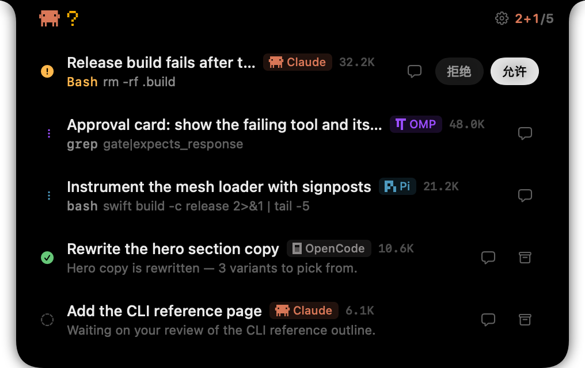
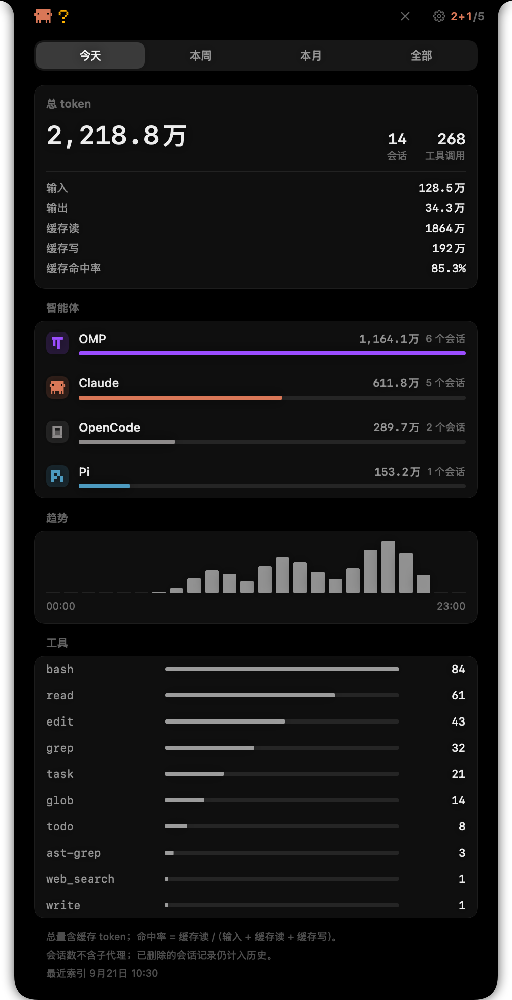
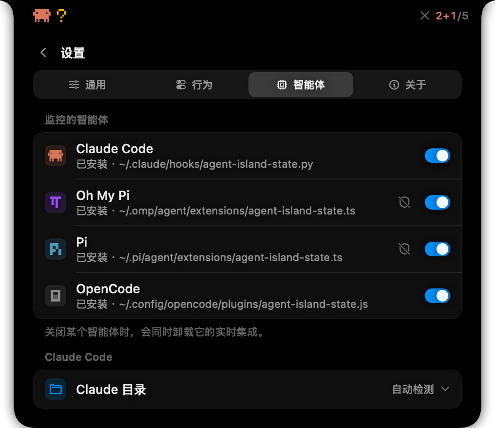
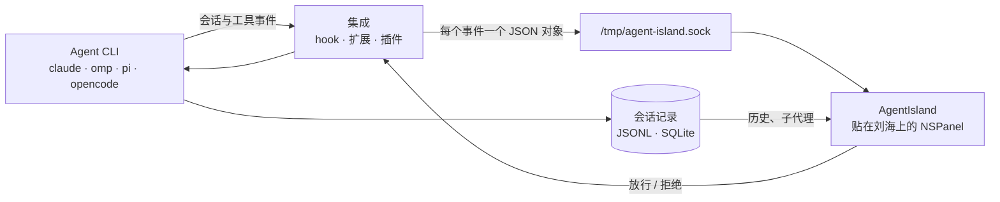

<div align="center">
  
  <h1 align="center">AgentIsland</h1>
  <p align="center">
    <b>你的编码 Agent，就挂在 MacBook 刘海上。</b><br>
    为 Claude Code、Oh My Pi、Pi 与 OpenCode 提供实时会话状态、对话历史与工具审批 —— 抬眼即见，不用切窗口。
    <br><br>
    <a href="https://github.com/seehar/agent-island/releases/latest"></a>
    <a href="https://github.com/seehar/agent-island/releases"></a>
    
    
    <a href="LICENSE.md"></a>
  </p>
</div>

[English](README.md) | **简体中文**



## 为什么

tmux 里开两个 Agent，你就得在两个 pane 之间切来切去看谁在等你；开到五个，一个权限提示能在你读代码时晾上十分钟。

刘海是屏幕上你永远不会离开的那一条。AgentIsland 把它变成 Agent 的状态灯：

- **关闭态** —— 平时只留一条不碍事的胶囊：左侧标记在有 Agent 工作时动起来，右侧读作 `活跃[+子代理]/总数`。
- **悬停** —— 展开成一张跨所有 Agent 的实时会话列表。
- **审批** —— 需要权限的工具调用会把面板展开成 Allow / Deny，你的决定直接回传给 Agent。

- **统计** —— 设置面板里的「统计」分组：token、会话数与工具调用次数的用量页，按 Agent 拆分，分今天 / 本周 / 本月 / 全部；头部的图表按钮一点直达。

<table>
  <tr>
    <td width="50%"></td>
    <td width="50%"></td>
  </tr>
  <tr>
    <td align="center"><sub>关闭态：品牌标记 + 工作中的会话</sub></td>
    <td align="center"><sub>待批的工具调用，就地决策</sub></td>
  </tr>
</table>

## 功能

**所有 Agent 一张列表。** Claude Code、Oh My Pi（`omp`）、Pi、OpenCode 的会话并排显示，各自带品牌角标。不用的 Agent 关掉即从列表消失。

**子代理也在列表里。** Claude Code 子代理内部的工具调用、以及 `omp`/`pi` 的子代理运行，都计入刘海计数，并列在派发它的 `task` 卡片下。

**在刘海上审批。** 四个 Agent 都支持 Allow / Deny：Claude Code 走 hook，`omp`/`pi` 走扩展的阻塞闸门（需手动开启），OpenCode 走插件。被判为危险的调用（`rm -rf /`、`sudo rm`、`mkfs`、`dd … of=/dev/…`、`curl … | sh`、反弹 shell、`kill -9 1` 等）会标红，且**永不**走「不可达就放行」这条降级路径。

**用量统计。** 统计页在设置面板的「统计」分组里（头部图表按钮一点直达）：token 总量（含输入 / 输出 / 缓存读 / 缓存写与命中率）、会话数与工具调用次数，按 **今天 / 本周 / 本月 / 全部** 分档，并按 Agent 拆分，另带趋势柱图与工具榜。数字来自对 Agent 自身会话记录的索引，已结束的会话也计入。

**渲染出来的对话历史。** 完整会话内容：Markdown 渲染、工具调用卡片带结果、子代理运行内联显示；工具在等你回答时，问题也在这里。


**装不装集成都能用。** 会话通过读取 Agent 自己写的记录（JSONL 记录文件，或 OpenCode 的 SQLite 库）发现，状态从记录里推断；装上集成立刻有实时事件，`omp`/`pi` 的审批闸门也依赖它。

**刻意的「小」。** 没有 Dock 图标、没有菜单栏项、没有常驻守护进程：一个本地 Unix socket、一块贴在刘海上的 `NSPanel`，以及 Agent 自己的文件。

**随你调。** 悬停延时、空闲表现、面板尺寸、行信息密度、单击动作、刷新频率、提示音范围、内容字号、胶囊高度与宽度、界面语言（English / 简体中文）—— 都是运行时切换。

## 用量统计



统计页在**设置 → 统计**里（头部图表按钮一点直达），读的是与对话页同一批记录，只把聚合计数留在应用自己的存储里。总量包含缓存 token（命中率 = 缓存读 /（输入 + 缓存读 + 缓存写））；会话数不计子代理。首次打开时在后台索引，页面会显示最近一次索引时间。范围切换右侧的 ↻ **重新统计**按钮会把每个 Agent 的记录从头重读一遍并重算已经统计过的数字——后台那轮只读记录的尾部，所以数字对不上时走这条。

## 支持的 Agent

|Agent|会话记录|实时集成|刘海审批|子代理|
|---|---|---|---|---|
|**Claude Code**|`~/.claude/projects/**/*.jsonl`|`~/.claude/hooks/agent-island-state.py` + `settings.json`|支持 —— hook `PermissionRequest`|子代理内部的工具调用|
|**Oh My Pi**（`omp`）|`~/.omp/agent/sessions/**`|`~/.omp/agent/extensions/agent-island-state.ts`|支持 —— 扩展闸门（需开启）|`task` 运行|
|**Pi**|`~/.pi/agent/sessions/**`|`~/.pi/agent/extensions/agent-island-state.ts`|支持 —— 扩展闸门（需开启）|`task` 运行|
|**OpenCode**|`~/.local/share/opencode/opencode.db`|`~/.config/opencode/plugins/agent-island-state.js`|支持 —— 插件|`task` 运行|

## 安装

**系统要求：** macOS 15.6 及以上，Apple Silicon。

从 [Releases](https://github.com/seehar/agent-island/releases/latest) 下载最新的 `AgentIsland-x.y.z.dmg`，打开后把 **AgentIsland** 拖进 `Applications`。

> **关于首次打开的警告。** 产物是 ad-hoc 签名、未经 Apple 公证，因此 Gatekeeper 会拦下第一次打开：右键应用选「打开」，或一次性清掉隔离属性：
>
> ```bash
> xattr -dr com.apple.quarantine /Applications/AgentIsland.app
> ```

也可以自己构建（需要 Xcode），走与发布同一套流程：

```bash
git clone https://github.com/seehar/agent-island.git
cd agent-island

./scripts/build-and-install.sh               # 门禁 → 归档 → ad-hoc 重签 → 安装 → 启动
./scripts/build-and-install.sh --build-only  # 只产出 build/export/AgentIsland.app 与 releases/*.dmg
./scripts/build-and-install.sh --no-launch   # 只安装，不启动
```

脚本第一步会跑 `scripts/gate.sh`（本地化守卫 + Release 编译必须 0 诊断），不达标即中止。

## 首次运行

AgentIsland 只为每个 Agent 写**一个**文件（它的集成），并在你关闭该 Agent 时删掉。磁盘上其它东西一概不动。

|Agent|写入文件|还会动到|
|---|---|---|
|Claude Code|`~/.claude/hooks/agent-island-state.py`|往 `~/.claude/settings.json` 合并 hook 条目|
|Oh My Pi|`~/.omp/agent/extensions/agent-island-state.ts`|仅当你开启闸门时：`~/.omp/agent/config.yml`（先备份）|
|Pi|`~/.pi/agent/extensions/agent-island-state.ts`|—|
|OpenCode|`~/.config/opencode/plugins/agent-island-state.js`|—|

在 **设置 → 智能体**（面板里的齿轮按钮 → 「智能体」页）可以看到每个 Agent 的集成状态与落点。状态显示**「已过期 — 请重装」**表示磁盘上那份不是本构建期望的版本 —— 把该 Agent 关掉再打开即可重写。

**给 `omp` / `pi` 打开审批闸门。** 智能体行里的盾牌按钮会把刘海变成该 Agent 的审批闸门。动手前有两点值得知道：

- `omp` 的 `tools.approvalMode` 默认是 `yolo`，它自己从不询问。闸门关着时，该 Agent **完全没有**审批闸门 —— 不存在「回落到 omp 自己的提示」。
- 打开闸门会同时抬高 `omp` 的扩展 handler 预算，好让工具调用等得及你；原值会被备份，关掉闸门时还原。

## 设置



|页面|内容|
|---|---|
|**通用**|语言、屏幕、胶囊高度、胶囊宽度、内容字号、面板尺寸 · 登录时启动、辅助功能状态|
|**智能体**|每个 Agent 的启用开关、集成状态与落点、审批闸门盾牌（`omp` / `pi`）、Claude Code 配置目录 · **审批闸门**卡片：闸门问什么（写与命令 / 只问危险命令 / 始终允许）、应用未运行时怎么办、待批时自动展开（仅当决定只能在刘海上给 / 总是 / 从不）|
|**行为**|悬停展开（从不 / 快 / 标准 / 慢）、空闲胶囊（一直显示 / 有活动时 / 保留 3 秒）、完成提示（10 秒 / 30 秒 / 1 分钟 / 一直） · 已结束会话保留、行信息密度、单击动作（无 / 打开对话 / 聚焦终端）、刷新频率 · 通知音效、提示音范围（仅就绪 / 就绪与审批）|
|**关于**|版本、检查更新、自动检查更新、在 GitHub 上加星、退出|

单击会话行按上面的「单击动作」执行；双击始终打开对话。

## 工作原理



所有状态变化只经过唯一入口 `SessionStore.process(_:)`，视图从不直接改状态。审批是请求 / 应答：集成会一直握着连接等你决定，决定再经同一条 socket 回传 —— Claude Code 通过 hook 的 stdout 拿到，`omp`/`pi` 靠解除工具调用的阻塞，OpenCode 通过它的 HTTP reply 端点。

**应用不在跑时**，集成不会挡你的路：Claude Code 回落到自己的提示，OpenCode 把审批交还它的 TUI，`omp`/`pi` 的闸门按自身的降级档处理（默认 `notify-only`：放行并在终端里留可见提示；`strict` 一律拒绝；`read-only-allow` 拒绝写入与执行）。危险命令在前两档下都拒绝；例外是「始终允许」档 —— 它什么都不问，因此也没有危险命令的兜底。而应用在跑、但你超时没答时，闸门会拒绝 —— 没人应答不等于同意。

## 隐私

- Agent 通过本地 Unix socket 与应用通信；应用不开任何端口，不向任何地方发送数据。
- 没有任何埋点与遥测：应用只保留上面那份用量聚合计数，且完全在本机计算。
- 唯一的联网行为是 Sparkle 查更新（本仓库 GitHub Pages 上的 appcast）。
- 应用只读 Agent 自己写的会话记录，从不修改它们。
- 用量统计只是存在应用自己存储里的聚合计数；会话记录始终只读。

## 常见问题

**刘海里什么都没出现。** AgentIsland 是配件型应用：没有 Dock 图标、没有菜单栏项、没有窗口 —— 刘海面板就是它唯一的界面。把鼠标移到刘海上展开它，并确认 **设置 → 智能体** 里至少启用了一个 Agent。无活动时胶囊会按设计收起来；把「空闲胶囊」设为「一直显示」即可常驻。

**某个会话不显示，或出现得很慢。** 未安装集成的 Agent 靠扫描记录目录（或 OpenCode 的库）发现，因此新会话要等一个「刷新频率」周期。看该 Agent 的状态行：显示**「未安装」**时把它关掉再打开即可写入集成。

**「已过期 — 请重装」。** 磁盘上的集成不是本构建期望的版本（手改过，或升级后尚未重写）。把该 Agent 关掉再打开。

**我没应答，工具调用却被拒了。** 这是闸门的失败语义：应用不可达时由降级档决定；能连上但超时未答则拒绝。想多想想，就把请求超时调大。

**Gatekeeper 说应用已损坏。** 并没有损坏 —— 它是 ad-hoc 签名、未经公证。右键选「打开」，或清掉隔离属性（见[安装](#安装)）。

**「聚焦终端」没反应。** 跳回 pane 只对 tmux 会话提供，并且需要 [yabai](https://github.com/koekeishiya/yabai) 把窗口提到前面；没有 yabai 时，改用对话页查看会话在做什么。

**怎么退出 / 卸载？** 面板「关于」页有**退出**。卸载：退出后把应用从 `Applications` 拖走，再删掉你不再需要的集成文件（在 **设置 → 智能体** 里关掉某个 Agent 就已经删掉它的集成）；`defaults delete com.celestial.AgentIsland` 可清掉偏好。

## 致谢与许可

AgentIsland 派生自 [farouqaldori/vibe-notch](https://github.com/farouqaldori/vibe-notch)（即此前的 Claude Island），改名并扩展了 Oh My Pi / Pi / OpenCode 集成、多 Agent 审批、子代理可见性与设置面板。以 **Apache-2.0** 许可发布，见 [LICENSE.md](LICENSE.md)。
